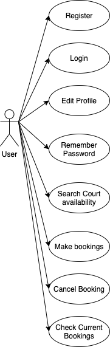
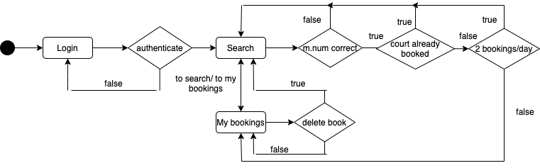
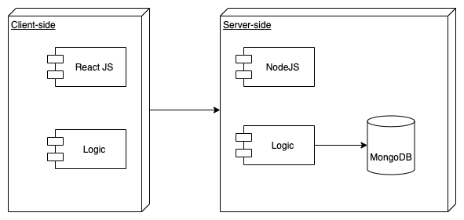
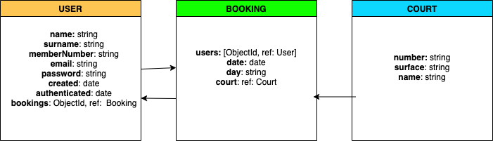
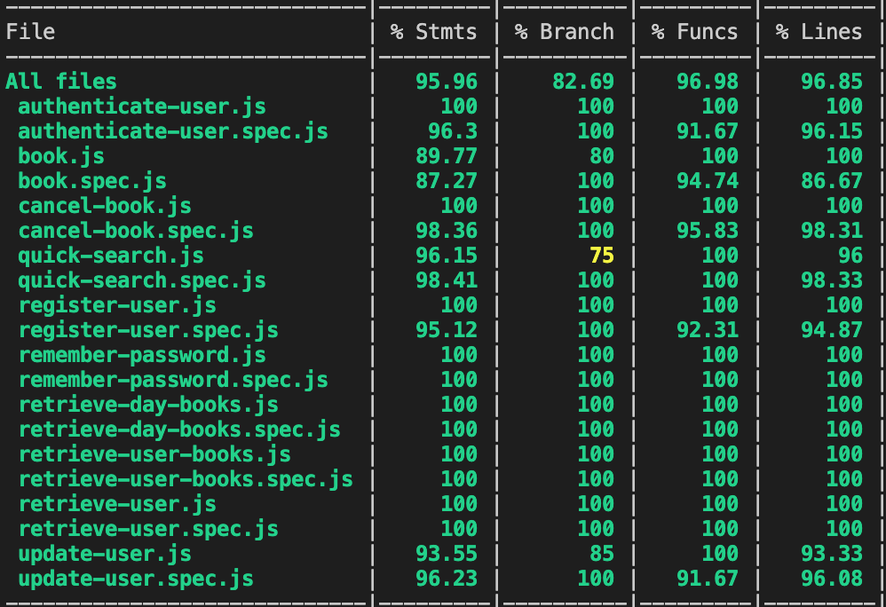

# BREAK-POINT

 

Tennis club web where the user can book and organize matches with other members of the club. 

Landing page with some information about the club and a membership area where the member can edit his profile,  make and manage his bookings, and check the availability of the tennis courts. 

## FUNCTIONAL DESCRIPTION

The user have to register on the app to use all the functionalities. The functionalities availables are:

<ul>
    <li>Make a booking</li>
    <li>Cancel a booking</li>
    <li>Check availability of all the courts</li>
    <li>View weather conditions of the current day and the next two days</li>
    <li>Search the first and make the booking of the first court available</li>
    <li>Check the current bookings</li>
</ul>

### Use Cases
 

### Flow

## Technical Description

### Blocks

### Data Model

### API code coverage

### Trello

[BreakPoint-Trello](https://trello.com/b/eD5tBeUx/break-point)
